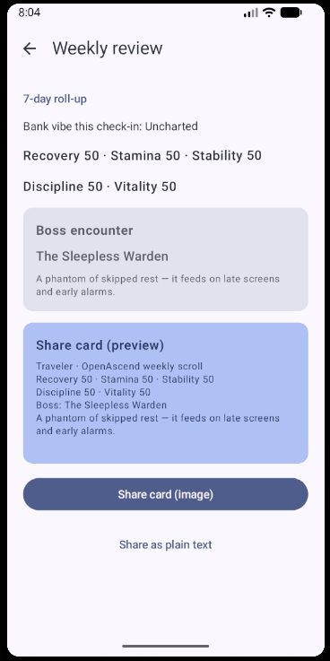

# OpenAscend

**Current version: v0.01** (`versionName` **0.01** in Gradle)

**Repository:** [github.com/dpastoetter/OpenAscend](https://github.com/dpastoetter/OpenAscend)

## Vision

OpenAscend is an **open-source, Android-first “life RPG”**: habits and simple life signals feed **stats, XP, levels, archetypes, quests, weekly bosses**, and **shareable recap cards**—**local-first** today, with room to add integrations later.

### Positioning

- **Tagline:** “Your life, scored like a game.”
- **Not** a generic habit grid—the fantasy is **character sheet + quests + boss week**, not accounting software.
- **Tone:** playful mirror; **not** medical, therapeutic, or financial advice. Copy stays light and disclaimer-friendly.

### Product loop

**Inputs:** habits, sleep, activity/steps, optional “bank vibe” / saving behavior, optional longevity-style proxies.  
**Outputs:** five core stats, daily XP and leveling, archetype/class line, daily quests, a **weekly boss** tied to the weakest stat, stability/bank-health flavor, and **PNG + text share** for reviews.

**Core stats**

| Stat | Primary signal (intent) |
|------|-------------------------|
| **Recovery** | Sleep |
| **Stamina** | Steps / activity |
| **Stability** | Bank-health / spending-saving behavior (manual journal in early builds) |
| **Discipline** | Habits |
| **Vitality** | Optional longevity proxies |

### Platform & architecture

| Area | Choice |
|------|--------|
| Platform | Android, Kotlin |
| UI | Jetpack Compose, Material 3 |
| Structure | Modular (`:app`, `:core:domain`, `:core:data`) |
| DI | Hilt |
| Async | Coroutines, Flow / StateFlow in ViewModels |
| Persistence | Room + DataStore |
| Navigation | Navigation Compose |
| Images | Coil (local profile files) |

**Clean architecture:** UI → ViewModels → domain services → repository interfaces → Room/DataStore. **Ports/adapters** in domain/data allow future **Health Connect**, banking, etc., with **manual entry** as the default path today. The MVP ships **without** `INTERNET` in the manifest—true **offline-first** until network features are added deliberately.

### Shipped vs roadmap

**In early releases (e.g. v0.01):** bootstrap → onboarding (local profile), home (morning overview, evening check-in, weekly review entry points), character sheet, habits list + edit, daily check-in (consolidated manual signals), weekly review + share, settings (theme + privacy flags; analytics/crash toggles are **placeholders** until real SDKs exist), dark/light/system theme.

**Roadmap (prioritize as needed):** Health Connect for steps/sleep; local notifications (morning, evening, boss); optional split screens for sleep / finance / longevity; a dedicated boss ritual screen; splash polish; cloud accounts only if the product leaves strict offline-first; billing only with a monetization story, `INTERNET`, Play Billing, and policy work.

### Screen map (intent)

| Flow | Early build | Later |
|------|-------------|--------|
| Entry / bootstrap | Yes | Branded splash |
| Auth | No (local profile) | Optional accounts |
| Onboarding, home, character, habits, check-in, weekly, settings | Yes | — |
| Sleep / finance / longevity | Inside check-in | Dedicated screens if UX needs |
| Boss | Inline / weekly | Full-screen ritual optional |
| Billing | No | When strategy exists |

### UX rules

- Feels like an **RPG character builder**, not a spreadsheet.
- **Game language:** stats, quests, bosses, streak armor, level-up.
- **Fast daily loop:** morning overview → evening check-in → weekly review.
- **Share cards:** one-glance social sharing (image + short text).

### Privacy & trust

Offline-first MVP: no telemetry wired to Settings toggles yet; add **`INTERNET`** only when network ships. Revisit **backup** rules if the DB holds sensitive journaling. **Sharing** is user-initiated only.

## Player feel

Design priorities for the RPG fantasy—apply these **in order** when shaping copy, layout, and motion.

### 1. Language is the cheapest legendary drop

- **Name everything in-world** where it fits: not only generic “Settings”—lean into chronicle / realm language when it stays clear (e.g. *Chronicle settings*).
- **Verbs over labels:** buttons like *Seal the day*, *Claim XP*, *Face the boss* beat *Save* / *Submit* when they’re still understandable.
- **Second-person, heroic:** *Your streak armor held* reads better than *Streak: 3*.
- **One disclaimer line per context** (health/finance), then commit to the fantasy without hedging every sentence.

### 2. Feedback = “the game noticed you”

- After check-in or habit completion: **short, specific** payoff—e.g. *+12 Discipline · Warden path*, not only a generic toast.
- **Level / XP bar motion** on real changes (even 200–300 ms) sells “progress” more than static numbers.
- **Micro-celebration** on rare beats (level-up, boss week rollover): banner, optional haptic, one line of flavor.

### 3. Structure the day like a quest log

- **Morning:** one headline plus **1–3 today’s objectives** (habits/quests) visible above the fold.
- **Evening:** *Close the chronicle*—what moved today (stats/XP), not a second full dashboard.
- **Weekly:** the **boss** is the emotional peak—name, one scary-fun line, **weak link** stat, then share.

### 4. Boss = character, not a card

- Give recurring bosses a **stable voice** (short clauses, one metaphor family—e.g. sleep/shadows) so the game feels consistent week to week.
- **Weak link** should read as **tactics** (*Recovery is the breach*) not judgment.

### 5. Character sheet = fantasy of self

- **Archetype + level** above the fold; stats should feel like a **loadout**, not a form.
- A **flavor line** under level that can evolve with streak or level band so repeat visits feel alive.

### 6. Pacing: fewer choices, stronger default

- **One primary action** per screen where possible; secondary actions visually quieter.
- **Empty states** are story beats: e.g. *No quests inscribed yet—forge your first rite* plus a single clear button.

### 7. Sound & haptics (later, optional)

- One **soft** success sound and a **light** haptic on “quest sealed” can double perceived quality—add after core copy and motion feel right.

**Suggested build order:** (1) copy on **home**, **check-in**, and **weekly**; (2) post-action feedback plus XP motion; (3) boss block on weekly as the dramatic set piece.

## Features

- **Onboarding** — Set a hero name and initial quest goals to start your run.
- **Daily flows** — Morning overview and evening check-in style surfaces to anchor the day.
- **Character & progression** — Level, XP, and stat-style metrics tied to your activity.
- **Habits** — Create and manage habits; edit flows are integrated in the app shell.
- **Profile** — Optional profile image (camera/gallery) stored on device.
- **Appearance** — Light/dark (or system) theme preference persisted locally.
- **Share** — Generate bitmap recap cards for sharing (via Android share sheet where supported).

Data is stored on the device (Room, DataStore). There is no bundled cloud sync in this early release.

## Screenshots

Captured from a debug build (light theme):

| Home & character | Weekly review |
|------------------|----------------------------|
|  | |

More captures from a running build:

```bash
adb exec-out screencap -p > shot.png
```

## Project structure

| Module | Role |
|--------|------|
| `:app` | Android application, Compose UI, navigation, Hilt wiring |
| `:core:domain` | Domain models and use-case style logic (pure Kotlin) |
| `:core:data` | Persistence (Room), repositories, DataStore preferences |

Versioning: **v0.01** — `versionName` `0.01`, `versionCode` `2` in `app/build.gradle.kts`. Package id: `com.openascend.app`. **minSdk 26**, **targetSdk / compileSdk 35**.

## Tech stack

- Kotlin, Coroutines
- Jetpack Compose, Material 3
- Room, DataStore
- Hilt (dependency injection)
- Coil (image loading)
- Gradle with Kotlin DSL, version catalogs (`gradle/libs.versions.toml`)

## Requirements

- **JDK 17** (Gradle uses the toolchain declared in the build scripts)
- **Android SDK** with API 35 for builds; **platform tools** (`adb`) for installing APKs on hardware or emulators

## Build

```bash
./gradlew :app:assembleDebug
```

Output: `app/build/outputs/apk/debug/app-debug.apk`

Install on a connected device or emulator:

```bash
adb install -r app/build/outputs/apk/debug/app-debug.apk
```

**`INSTALL_FAILED_UPDATE_INCOMPATIBLE` (signatures do not match):** the device already has `com.openascend.app` signed with a **different** key—common when you mix a **GitHub Release / CI APK** with a **local** `./gradlew installDebug` build. Android will not upgrade over that. Remove the old install, then install again:

```bash
./gradlew :app:uninstallDebug
./gradlew :app:installDebug
```

Or: `adb uninstall com.openascend.app` then `installDebug` / `adb install -r …` as above.

## Prebuilt APK (GitHub Releases)

Each [GitHub Release](https://github.com/dpastoetter/OpenAscend/releases) publishes a **debug** APK built in CI (`OpenAscend-<tag>-debug.apk`), signed with CI’s debug keystore (install for local testing only). That signature **differs** from your machine’s local debug keystore—switching between them requires **`uninstallDebug`** / `adb uninstall com.openascend.app` first (see above).

**Create a new release build:**

1. Tag the commit you want to ship, then push the tag (workflow [`.github/workflows/release-apk.yml`](.github/workflows/release-apk.yml) builds and attaches the APK):

   ```bash
   git tag -a v0.01 -m "OpenAscend v0.01"
   git push origin v0.01
   ```

2. Or open **Actions → Release APK → Run workflow**, set the tag (e.g. `v0.01`), and run it from `main` (the release and tag are created for that commit).

Every push to `main` also uploads a debug APK as a workflow artifact from [CI](.github/workflows/ci.yml) (no Release).

## Tests

```bash
./gradlew :core:domain:test
./gradlew :core:data:testDebugUnitTest
./gradlew :app:testDebugUnitTest
```

Or run the same set the CI job uses:

```bash
./gradlew :core:domain:test :core:data:testDebugUnitTest :app:testDebugUnitTest :app:assembleDebug
```

### Continuous integration

[`.github/workflows/ci.yml`](.github/workflows/ci.yml) runs on pushes to `main`/`master` and on pull requests:

- **build** — Domain, data, and app unit tests (including Compose/Robolectric where configured) plus `assembleDebug`; uploads the debug APK as a workflow artifact.
- **instrumented** — `connectedDebugAndroidTest` on an API 34 `google_apis` x86_64 emulator (smoke / integration coverage).

## Emulator (optional)

```bash
./scripts/run-emulator.sh
```

The script documents AVD locations (including Flatpak Android Studio on Linux), lock-file cleanup, and GPU options when the default emulator path misbehaves on some distros.

If the app **closes immediately** or **won’t install**: uninstall any older build (`adb uninstall com.openascend.app`), reinstall the fresh debug APK, then capture a crash with `adb logcat -d | grep -E 'AndroidRuntime|OpenAscend'` and open an issue with that snippet.

## Contributing

Issues and pull requests are welcome. Please keep changes focused and match existing Kotlin/Compose style. Run the unit test tasks above before opening a PR; CI will run the full matrix.

## License

OpenAscend is released under the [MIT License](LICENSE).
