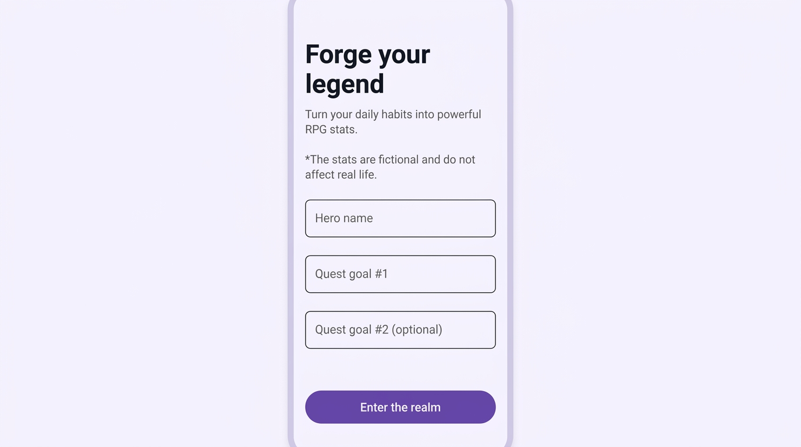
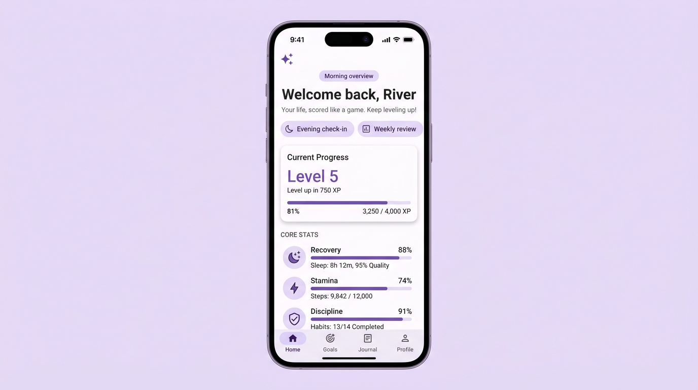
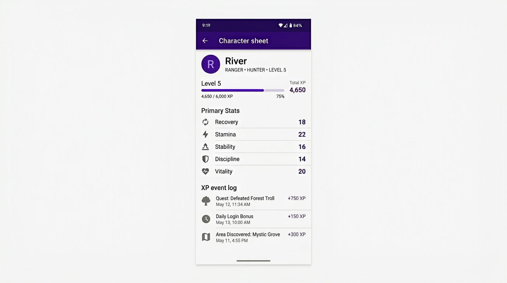

# OpenAscend

OpenAscend is an Android app that frames daily habits and check-ins as a light RPG-style progression loop: onboarding, morning/evening flows, character stats, XP, and shareable recap cards. It is built with Kotlin, Jetpack Compose, Room, DataStore, and Hilt.

**Repository:** [github.com/dpastoetter/OpenAscend](https://github.com/dpastoetter/OpenAscend)

## Screenshots

Representative UI (documentation mockups):

| Onboarding | Home overview | Character sheet |
|------------|---------------|------------------|
|  |  |  |

For pixel-accurate captures from a running build, use an emulator or device and `adb exec-out screencap -p > shot.png`.

## Requirements

- **JDK 17**
- **Android SDK** with API 35 (compile SDK), platform tools for `adb` when installing APKs

## Build

```bash
./gradlew :app:assembleDebug
```

Debug APK: `app/build/outputs/apk/debug/app-debug.apk`

## Tests

```bash
./gradlew :core:domain:test
./gradlew :core:data:testDebugUnitTest
./gradlew :app:testDebugUnitTest
```

CI (GitHub Actions) runs domain and data unit tests, app unit tests, `assembleDebug`, and an instrumented job when configured.

## Emulator (optional)

```bash
./scripts/run-emulator.sh
```

See script comments for AVD paths (including Flatpak Android Studio) and GPU options on Linux.

## License

See repository files for license terms if present.
