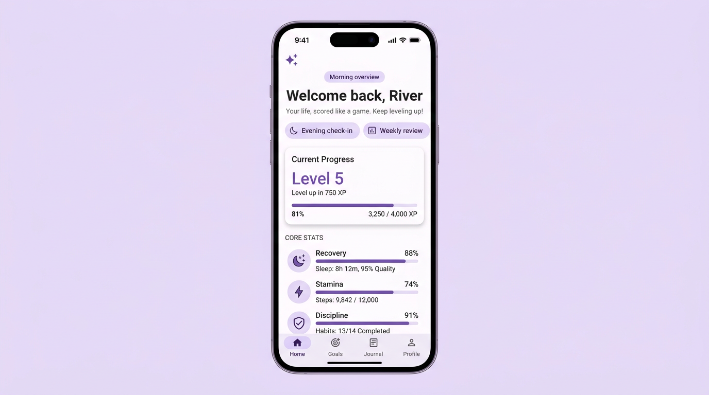
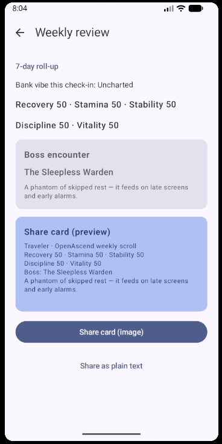

# OpenAscend

**Current version: v0.14** (`versionName` **0.14**, `versionCode` **14** in Gradle)

**Repository:** [github.com/dpastoetter/OpenAscend](https://github.com/dpastoetter/OpenAscend)

## Vision

OpenAscend is an **open-source, Android-first “life RPG”**: habits and simple life signals feed **stats, XP, levels, archetypes, quests, weekly bosses**, and **shareable recap cards**—**local-first** today, with room to add integrations later.

### Positioning

- **Tagline:** “Your life, scored like a game.”
- **Not** a generic habit grid—the fantasy is **character sheet + quests + boss week**, not accounting software.
- **Tone:** playful mirror; **not** medical, therapeutic, or financial advice. Copy stays light and disclaimer-friendly.

### Product loop

**Inputs:** habits, sleep, activity/steps, optional “bank vibe” / saving behavior, optional longevity-style proxies.  
**Outputs:** five core stats, daily XP and leveling, archetype/class line, daily quests, a **weekly boss** tied to the weakest stat, stability/bank-health flavor, and **PNG + text share** for reviews.

**Core stats**

| Stat | Primary signal (intent) |
|------|-------------------------|
| **Recovery** | Sleep |
| **Stamina** | Steps / activity |
| **Stability** | Bank-health / spending-saving behavior (manual journal in early builds) |
| **Discipline** | Habits |
| **Vitality** | Optional longevity proxies |

### Platform & architecture

| Area | Choice |
|------|--------|
| Platform | Android, Kotlin |
| UI | Jetpack Compose, Material 3 |
| Structure | Modular (`:app`, `:core:domain`, `:core:data`) |
| DI | Hilt |
| Async | Coroutines, Flow / StateFlow in ViewModels |
| Persistence | Room + DataStore |
| Navigation | Navigation Compose |
| Images | Coil (local profile files) |

**Clean architecture:** UI → ViewModels → domain services → repository interfaces → Room/DataStore. **Ports/adapters** in domain/data allow future **Health Connect**, banking, etc., with **manual entry** as the default path today. The MVP ships **without** `INTERNET` in the manifest—true **offline-first** until network features are added deliberately. A **network security config** disables cleartext HTTP globally as defense in depth.

### Shipped vs roadmap

**Shipped in recent builds (e.g. v0.05+):** bootstrap → onboarding (hero name, optional **starter path** / class fantasy, goals, **companion species**—enables the Home familiar when onboarding completes), home (**Chronicle Compass** card—one primary CTA for evening check-in, weekly review, boss, or top quest; **habit quick-seal** with tiered discipline XP; welcome-first hero strip, familiar strip with **cute chibi pixel sprites** when expanded—mood-matched, optional **memory whisper** from recent moods; **Play together** opens a **companion games hub** with a **daily trial** highlight), companion hub games: **Treat toss**, **Flash sigils**, **Echo sigils**, **Glide loop** (in-world pause, 3-2-1 count-in, flap pulse), **Stack drop**, **Thread-run**; **shared daily chronicle XP** (+10 once per day, first qualifying session), **daily boon** label when unclaimed), **daily quests** (XP, spotlight bump, **quest seal** feedback line: `+XP · stat · path`), **animated XP bar** on Home, character sheet (**streak armor lore**), habits (**boss-prep** tag + seal feedback), check-in (string resources, **Health Connect** badges when synced, invite card when HC off; evening seal feedback; optional **Seal the sigil** micro-ritual), weekly review (**XP ledger** breakdown + **bitmap** recap share with XP story), **boss ritual** (week-state copy—deferred / wounded / sealed; **boss-prep meter** on Home; **+40 XP** once per week when sealed), settings (theme, narrative packs, familiar, companion difficulty, **Health Connect** sync toggle, reminders), **local reminders** (skip evening if already logged; boss nudge only if unsealed; weakest-stat flavor), **home widget** (tap opens Compass-aligned deep link; daily boon line), dark/light/system theme. **Daily plain-text “sigil” share** from Home was removed in favor of weekly share.

**v0.14 (offline viral layer):** **peak-moment share cards** (level-up, streak milestones 7/14/30, boss sealed, Day 0 onboarding preview, Glide personal best) as PNG + caption; **weekly share card v2** (level, archetype, XP ledger highlights, familiar art, Play Store CTA on image); **3-step onboarding** with realm preview + optional Day 0 card; **Chronicle replay** (14-day timeline from Home); **Chronicle duel** (export/import weekly stat summary JSON, compare offline—no accounts); **stat quest micro-chains** for all five stats via narrative JSON; widget **streak + boss sealed** line; **3-day companion play** familiar emote.

**Roadmap (prioritize as needed):** deeper Health Connect onboarding; in-world pause on Stack / Thread-run (Glide already has it); replay timeline share card; optional split screens for sleep / finance / longevity; branded splash; cloud accounts only if the product leaves strict offline-first; billing only with a monetization story, `INTERNET`, Play Billing, and policy work.

### Screen map (intent)

| Flow | Early build | Later |
|------|-------------|--------|
| Entry / bootstrap | Yes | Branded splash |
| Auth | No (local profile) | Optional accounts |
| Onboarding (3-step + preview), home, character, habits, check-in, weekly, settings | Yes | — |
| Chronicle replay, chronicle duel | Yes (in-app navigation) | Deep links optional |
| Sleep / finance / longevity | Inside check-in | Dedicated screens if UX needs |
| Boss | Weekly ritual screen | — |
| Billing | No | When strategy exists |

### UX rules

- Feels like an **RPG character builder**, not a spreadsheet.
- **Game language:** stats, quests, bosses, streak armor, level-up.
- **Fast daily loop:** morning overview → evening check-in → weekly review.
- **Share cards:** one-glance social sharing (image + short text).

### Privacy & trust

Offline-first MVP: no telemetry wired to Settings toggles yet; add **`INTERNET`** only when network ships. **Backup:** Settings can save a plaintext JSON snapshot (including preferences) via the system file picker—store exports carefully. **Google cloud backup** intentionally **excludes** Room, DataStore, and app SharedPreferences (see `res/xml/backup_rules.xml` and `data_extraction_rules.xml`) so chronicle data is not uploaded to Google’s backup servers; **device-to-device transfer** can still copy that data when the user migrates phones. **Sharing** is user-initiated only. **Release builds** strip verbose `Log` calls via R8 (`proguard-rules.pro`) to reduce accidental leakage in logcat.

**Defense in depth (app hardening):** `openascend://` deep links are only honored when the URI **scheme** is `openascend` (see `DeepLinkMapper.validatedDeepLinkRoute` + `OpenAscendAppContent`). Profile avatars resolve under `filesDir` with **canonical path checks** (`SafeUserFiles`) so stored relative paths cannot traverse outside app files. Gallery/camera avatar import decodes images with **dimension caps** and safe failure modes (`ProfileAvatarImporter`). Cleartext HTTP remains **disabled** globally (`res/xml/network_security_config.xml`).

## Player feel

Design priorities for the RPG fantasy—apply these **in order** when shaping copy, layout, and motion.

### 1. Language is the cheapest legendary drop

- **Name everything in-world** where it fits: not only generic “Settings”—lean into chronicle / realm language when it stays clear (e.g. *Chronicle settings*).
- **Verbs over labels:** buttons like *Seal the day*, *Claim XP*, *Face the boss* beat *Save* / *Submit* when they’re still understandable.
- **Second-person, heroic:** *Your streak armor held* reads better than *Streak: 3*.
- **One disclaimer line per context** (health/finance), then commit to the fantasy without hedging every sentence.

### 2. Feedback = “the game noticed you”

- **Shipped:** After **quest seal**, **habit seal**, and **evening check-in seal**, snackbars show **`+XP · stat · path`** (see `FeedbackLineFormatter`). Home **XP bar** tweens ~300 ms on progress changes.
- **Shipped:** Quest seal uses `FeedbackController` (sound/haptics); habit and check-in seals have differentiated patterns.
- **Shipped:** **Level-up**, **streak milestones**, and **boss sealed** use celebration dialogs with optional **Share card** (bitmap + share-sheet caption).

### 3. Structure the day like a quest log

- **Morning:** one headline plus **1–3 today’s objectives** (habits/quests) visible above the fold.
- **Evening:** *Close the chronicle*—what moved today (stats/XP), not a second full dashboard.
- **Weekly:** the **boss** is the emotional peak—name, one scary-fun line, **weak link** stat, then share.

### 4. Boss = character, not a card

- Give recurring bosses a **stable voice** (short clauses, one metaphor family—e.g. sleep/shadows) so the game feels consistent week to week.
- **Weak link** should read as **tactics** (*Recovery is the breach*) not judgment.

### 5. Character sheet = fantasy of self

- **Archetype + level** above the fold; stats should feel like a **loadout**, not a form.
- A **flavor line** under level that can evolve with streak or level band so repeat visits feel alive.

### 6. Pacing: fewer choices, stronger default

- **One primary action** per screen where possible; secondary actions visually quieter.
- **Empty states** are story beats: e.g. *No quests inscribed yet—forge your first rite* plus a single clear button.

### 7. Sound & haptics

- **Shipped:** distinct light patterns for **quest seal**, **habit seal**, **evening check-in seal**, and **level-up** (same base SFX, varied volume/rate + vibration waveforms)—see `FeedbackController`.

**Suggested build order (remaining polish):** (1) copy pass on any screens still using hardcoded English; (2) Stack / Thread pause parity with Glide; (3) replay timeline as a shareable card; (4) optional `openascend://` hosts for replay/duel.

## Features

### Sharing (offline-first viral)

All sharing is **user-initiated** via the system share sheet—no network required. Card templates live under `app/.../share/` (`WeeklyShareCard`, `LevelUpShareCard`, `BossSealedShareCard`, `CompanionRunShareCard`, `DayZeroShareCard`).

| Moment | Where | What gets shared |
|--------|--------|------------------|
| Weekly review | Weekly screen | Stats, boss, XP ledger highlights, familiar, Play CTA |
| Level up | Home dialog | Level, archetype, compliment, familiar |
| Streak 7 / 14 / 30 | Home dialog | Milestone celebration card |
| Boss sealed | Boss ritual | Boss name, weak stat, XP awarded |
| Day 0 | Onboarding preview | Hero, path, species + familiar |
| Glide PB | Glide summary | Score + game title (new personal best only) |

**Chronicle duel** — Export a redacted weekly summary JSON from Weekly → share with a friend → they import in **Chronicle duel** for a side-by-side stat comparison (no sync server).

### Core loop

- **Onboarding** — Three steps: **path & companion** → **goals** → **preview** with optional **Day 0 share card**, then enter the realm. Enables the Home familiar when you finish.
- **Home & daily loop** — **Chronicle Compass** surfaces the best next action (evening check-in, weekly review, boss, or seal top quest). **Welcome + familiar** strip with mood-matched pixel sprites; **companion memory** whispers when recent moods form a pattern; **3-day companion play** streak shows a familiar emote. **Animated XP bar**; quest/habit seals show **`+XP · stat · path`**. **Boss-prep meter** when habits are tagged for the weekly arc. Link to **Chronicle replay** from Home.
- **Companion hub** — Six mini-games; **today’s trial** banner rotates by calendar day (`epochDay % 6`). **Glide loop** adds in-world pause, 3-2-1 count-in, and flap pulse. **+10 chronicle XP** once per day for the **first qualifying** session (**shared pool** across games); Home and widget show when the **daily boon** is still available.
- **Quests** — Daily quests with XP; **wildcard** on Tue/Fri; seal feedback + **+5 spotlight** on the linked stat. **Stat micro-chains** (three-day quest streak per stat) swap in saga titles from `narrative/default.json` (`statQuestChains`).
- **Check-in** — Evening chronicle close: habits, mood tags, manual metrics; optional **Health Connect** sync (badges on auto-filled sleep/steps; invite card when off). Seal feedback uses path-aware copy; first seal of the day can offer **Seal the sigil** (flavor + haptics only).
- **Character & progression** — Level, XP, archetype; **streak armor** lore on the character sheet.
- **Habits** — Create/edit; optional **boss prep** tag; quick-seal from Home with tiered discipline XP and seal feedback.
- **Weekly review** — 7-day roll-up, boss block, **XP ledger** (check-in / quests / boss / companion / habits), defer-boss option, link to **Chronicle duel**, **bitmap** share (v2 card) with XP story in share text.
- **Chronicle replay** — Scrollable **last 14 days**: per-day stats, mood headline when logged, sealed/open flag (Home → Chronicle replay).
- **Boss week** — Generated from weakest stat; copy reflects **deferred**, active, or **sealed** week state. Ritual seal awards **40 XP** once per ISO week (Monday boundary).
- **Profile** — Optional profile image (camera/gallery) stored on device.
- **Appearance** — Light/dark (or system) theme preference persisted locally.
- **Widget** — Glance: level, quest, boss, **streak + boss sealed/unsealed**, flavor line; **tap** opens a Compass-aligned `openascend://` destination; **daily boon ready** line when applicable.
- **Reminders** — Optional local notifications; evening skipped if already logged today; Monday boss nudge skipped if boss sealed; copy names your weakest stat. Respects notification permission on Android 13+.

Data is stored on the device (Room, DataStore). **Room** is currently at **version 5** (`starterPath` on profile, `bossPrep` on habits)—see `DatabaseModule` migrations. There is no bundled cloud sync in this early release.

## Screenshots

Captured from a debug build (light theme):

| Home & character | Weekly review |
|------------------|----------------------------|
|  | |

More captures from a running build:

```bash
adb exec-out screencap -p > shot.png
```

## Project structure

| Module | Role |
|--------|------|
| `:app` | Android application, Compose UI, navigation, Hilt wiring |
| `:core:domain` | Domain models and use-case style logic (pure Kotlin) |
| `:core:data` | Persistence (Room), repositories, DataStore preferences, share/duel export helpers |

Versioning: **v0.14** — `versionName` `0.14`, `versionCode` `14` in `app/build.gradle.kts`. Package id: `com.openascend.app`. **minSdk 26**, **targetSdk / compileSdk 35**.

## Tech stack

- Kotlin, Coroutines
- Jetpack Compose, Material 3
- Room, DataStore
- Hilt (dependency injection)
- Coil (image loading)
- Gradle with Kotlin DSL, version catalogs (`gradle/libs.versions.toml`)

## Requirements

- **JDK 17** (Gradle uses the toolchain declared in the build scripts)
- **Android SDK** with API 35 for builds; **platform tools** (`adb`) for installing APKs on hardware or emulators

## Companion pixel art (optional)

Sprites live in `app/src/main/res/drawable-nodpi/` (`familiar_{species}_{mood}.png`). Regenerate from the generator script (Python 3 + Pillow):

```bash
cd app && python3 scripts/generate_familiar_sprites.py
```

Drawable IDs are mapped in `FamiliarPixelDrawable.kt`.

## Build

```bash
./gradlew :app:assembleDebug
```

Output: `app/build/outputs/apk/debug/app-debug.apk`

Install on a connected device or emulator:

```bash
adb install -r app/build/outputs/apk/debug/app-debug.apk
```

**`INSTALL_FAILED_UPDATE_INCOMPATIBLE` (signatures do not match):** the device already has `com.openascend.app` signed with a **different** key—common when you mix a **GitHub Release / CI APK** with a **local** `./gradlew installDebug` build. Android will not upgrade over that. Remove the old install, then install again:

```bash
./gradlew :app:uninstallDebug
./gradlew :app:installDebug
```

Or: `adb uninstall com.openascend.app` then `installDebug` / `adb install -r …` as above.

## Prebuilt APK (GitHub Releases)

Each [GitHub Release](https://github.com/dpastoetter/OpenAscend/releases) publishes a **debug** APK built in CI (`OpenAscend-<tag>-debug.apk`), signed with CI’s debug keystore (install for local testing only). That signature **differs** from your machine’s local debug keystore—switching between them requires **`uninstallDebug`** / `adb uninstall com.openascend.app` first (see above).

**Create a new release build:**

1. Tag the commit you want to ship, then push the tag (workflow [`.github/workflows/release-apk.yml`](.github/workflows/release-apk.yml) builds and attaches the APK):

   ```bash
   git tag -a v0.01 -m "OpenAscend v0.01"
   git push origin v0.01
   ```

2. Or open **Actions → Release APK → Run workflow**, set the tag (e.g. `v0.01`), and run it from `main` (the release and tag are created for that commit).

Every push to `main` also uploads a debug APK as a workflow artifact from [CI](.github/workflows/ci.yml) (no Release).

## Deep links (custom scheme)

`openascend://` hosts are registered on `MainActivity` for in-app navigation (e.g. widgets, shortcuts). Examples:

| Host | Destination |
|------|-------------|
| `home` | Home |
| `companion`, `companion_games` | Companion games hub |
| `companion_play` | Treat toss |
| `companion_memory` | Flash sigils |
| `companion_sequence` | Echo sigils |
| `companion_glide` | Glide loop |
| `companion_stack` | Stack drop |
| `companion_thread` | Thread-run |
| `check_in` / `checkin`, `weekly`, `boss`, `settings`, `character`, `habits` | Respective screens |

The home **widget** picks its tap target using the same priority as Chronicle Compass (evening check-in → weekly on Sunday → top quest host, etc.).

Only URIs whose **scheme** is `openascend` (case-insensitive) are mapped; other schemes are ignored even if the host looks familiar.

## Tests

**All JVM unit tests** (domain, data debug+release, app debug+release):

```bash
./gradlew test
```

**Per-module** (if you prefer):

```bash
./gradlew :core:domain:test
./gradlew :core:data:test
./gradlew :app:test
```

**Full verification** (unit tests + Android Lint on debug variants):

```bash
./gradlew check test
```

**Instrumented tests** (requires a running emulator or USB device):

```bash
./gradlew connectedDebugAndroidTest
```

CI-style quick gate:

```bash
./gradlew :core:domain:test :core:data:testDebugUnitTest :app:testDebugUnitTest :app:assembleDebug
```

### Continuous integration

[`.github/workflows/ci.yml`](.github/workflows/ci.yml) runs on pushes to `main`/`master` and on pull requests:

- **build** — Domain, data, and app unit tests (including Compose/Robolectric where configured) plus `assembleDebug`; Gradle build cache; uploads the debug APK as a workflow artifact.
- **instrumented** — `connectedDebugAndroidTest` on an API 34 `google_apis` x86_64 emulator (stat/XP smoke); longer timeout and pinned **android-emulator-runner** so cold builds can finish.

**Note:** JVM tests under `:app` that call **`android.net.Uri`** APIs should run with **Robolectric** (e.g. `@RunWith(RobolectricTestRunner::class)` + `@Config`) so `Uri.parse` behaves like on-device; see `DeepLinkMapperTest`.

## Emulator (optional)

```bash
./scripts/run-emulator.sh
```

The script documents AVD locations (including Flatpak Android Studio on Linux), lock-file cleanup, and GPU options when the default emulator path misbehaves on some distros.

If the app **closes immediately** or **won’t install**: uninstall any older build (`adb uninstall com.openascend.app`), reinstall the fresh debug APK, then capture a crash with `adb logcat -d | grep -E 'AndroidRuntime|OpenAscend'` and open an issue with that snippet.

## Contributing

Issues and pull requests are welcome. Please keep changes focused and match existing Kotlin/Compose style. Run `./gradlew test` (and `check` if you touch resources or manifest) before opening a PR; CI will run the full matrix.

## License

OpenAscend is released under the [MIT License](LICENSE).
